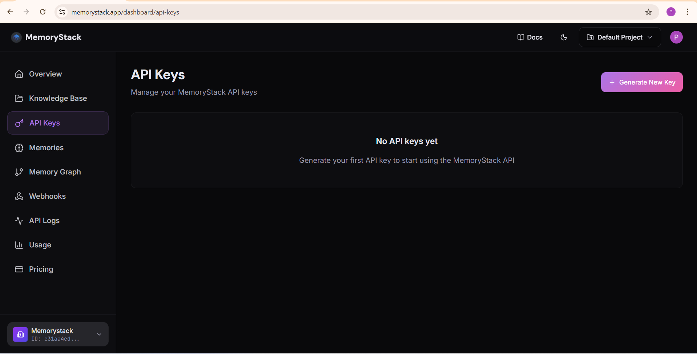
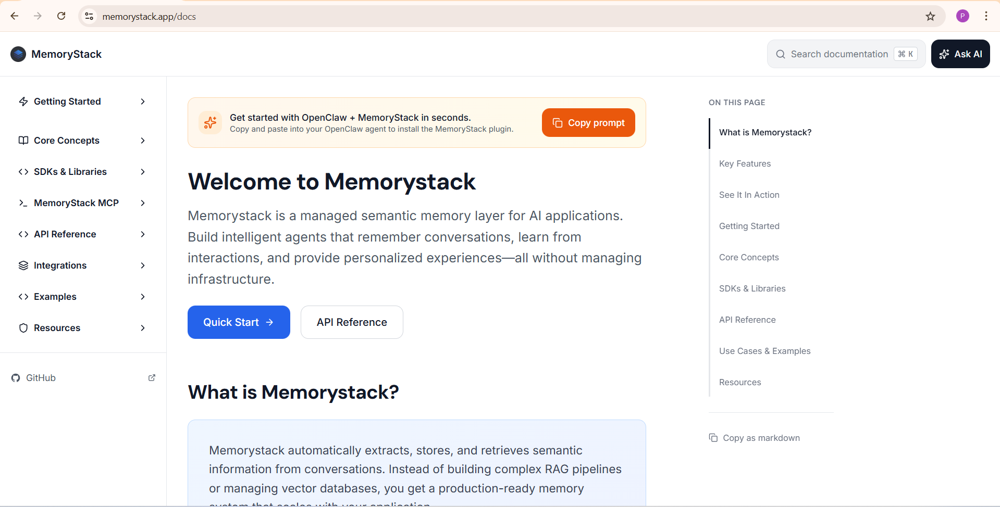
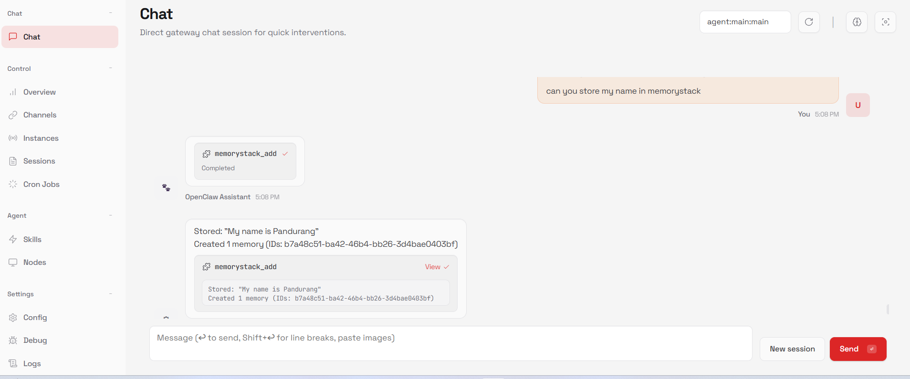
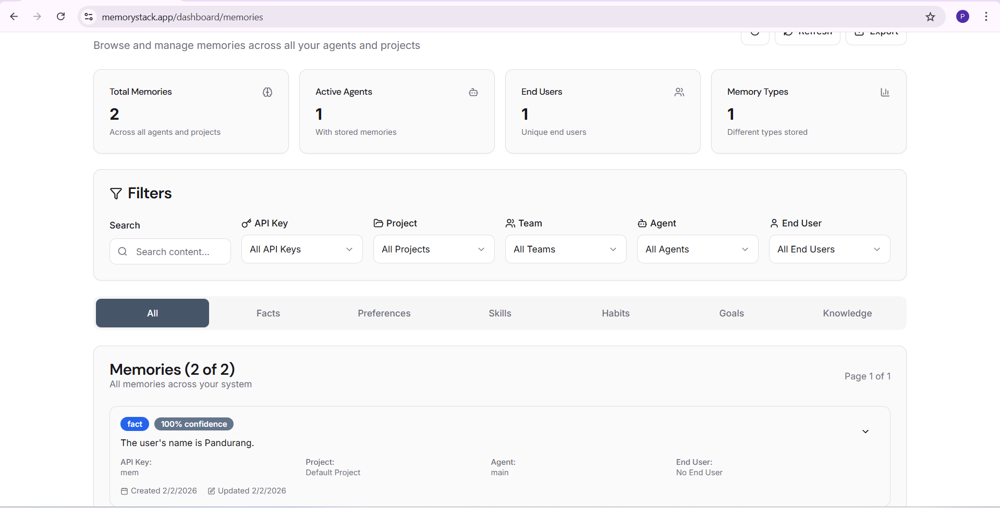
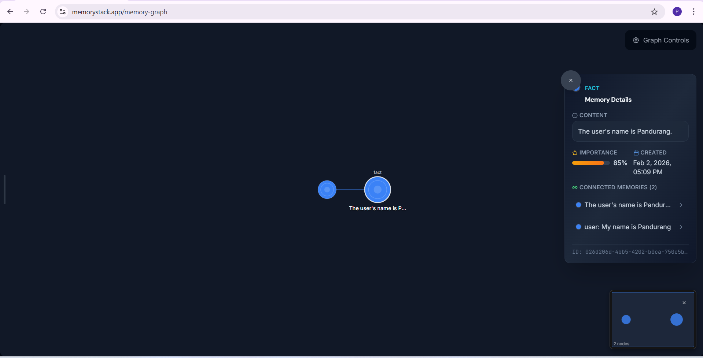

# MemoryStack Plugin for OpenClaw


Long-term memory for OpenClaw agents. Automatically remembers conversations, recalls relevant context, and builds a persistent user profile — all powered by [MemoryStack](https://memorystack.app).

> ** Requires a MemoryStack Account** - Get your API key at [memorystack.app/dashboard](https://memorystack.app/dashboard).

## Install

```bash
openclaw plugins install @memorystack/openclaw-memorystack
```

Restart OpenClaw after installing.

## Configuration

The only required value is your MemoryStack API key.

Set it as an environment variable:

```bash
export MEMORYSTACK_API_KEY="mem_live_..."
```

Or configure it directly in `openclaw.json` (usually `~/.openclaw/openclaw.json`):

```json
{
  "plugins": {
    "slots": {
      "memory": "openclaw-memorystack"
    },
    "entries": {
      "openclaw-memorystack": {
        "enabled": true,
        "config": {
          "apiKey": "mem_live_..."
        }
      }
    }
  }
}
```

---

## Getting Started

### Step 1: Get Your API Key

First, sign up at [memorystack.app](https://memorystack.app) and grab your API key from the dashboard.



You'll find your API key in the **Settings** section. Copy it — you'll need it for the next step.

---

## Installation (Choose One Method)

### Method 1: Automatic Install via OpenClaw Agent (Recommended)

The easiest way! Just let your OpenClaw agent do all the work.

1. Go to [memorystack.app/docs](https://memorystack.app/docs)
2. Click the **Copy prompt** button (see the orange button below)
3. Paste it into your OpenClaw agent
4. The agent will automatically install and configure the plugin for you!



That's it — your agent now has memory superpowers! 🚀

---

### Method 2: Manual Installation

If you prefer to install manually, follow these steps:

**Install the plugin:**

```bash
openclaw plugins install @memorystack/openclaw-memorystack
```

**Configure your API key** in `openclaw.json` (usually `~/.openclaw/openclaw.json`):

```json
{
  "plugins": {
    "slots": {
      "memory": "openclaw-memorystack"
    },
    "entries": {
      "openclaw-memorystack": {
        "enabled": true,
        "config": {
          "apiKey": "mem_live_..."
        }
      }
    }
  }
}
```

**Restart OpenClaw** and you're ready to go!

---

## Adding Memories

Once the plugin is installed, you can start adding memories. Just chat naturally with your OpenClaw agent — memories are captured automatically!

You can also add memories manually using slash commands:

```bash
/memorystack add I prefer dark mode for all my apps
```

Here's what it looks like when memories are being used:



---

## View Your Memories

Want to see all the memories your agent has stored? Head over to your [MemoryStack Dashboard](https://memorystack.app)!

### Memories Dashboard

Browse, search, and filter all your stored memories. You can filter by agent, project, end user, or memory type (Facts, Preferences, Skills, Habits, Goals, Knowledge).



### Memory Graph

See how your memories connect! The Memory Graph visualizes all your memories as connected nodes — showing how different facts and preferences relate to each other.



---

## Configuration Options

| Key | Type | Default | Description |
|-----|------|---------|-------------|
| `apiKey` | `string` | **Required** | Your MemoryStack API key. |
| `baseUrl` | `string` | `https://memorystack.app` | API endpoint URL (for self-hosted). |
| `autoRecall` | `boolean` | `true` | Inject relevant memories before every AI turn. |
| `autoCapture` | `boolean` | `true` | Automatically store conversation content after every turn. |
| `maxRecallResults` | `number` | `5` | Max memories injected into context per turn. |
| `debug` | `boolean` | `false` | Verbose debug logs for API calls and responses. |

---

## How it Works

Once installed, the plugin works automatically — no extra effort needed:

- **Auto-Recall** — Before every AI response, relevant memories (facts, preferences, past conversations) are pulled in as context.
- **Auto-Capture** — After every conversation, important information is automatically saved to your memory bank.

All memories are scoped to:
- **User ID** (`end_user_id`)
- **Agent ID** (`agent_id`)
- **Session ID** (`session_id`)

---

## Slash Commands

Talk to your memory directly from the chat:

```bash
/memorystack search <query>    # Find specific memories
/memorystack add <content>     # Save something important
/memorystack stats             # See your memory usage
/memorystack reflect           # Get insights from your memories
/memorystack consolidate       # Merge duplicate memories
```

---

## AI Tools

Your agent can use these tools on its own:

- `memorystack_search` — Search for stored information
- `memorystack_add_memory` — Save important info explicitly
- `memorystack_forget` — Remove outdated or incorrect memories

---

## Troubleshooting

**Memories not saving?**
- Make sure `autoCapture` is enabled (it's on by default)
- Double-check your API key is correct
- Turn on `debug: true` in config to see error messages

**Context not appearing?**
- Make sure `autoRecall` is enabled (it's on by default)
- Try `/memorystack search <query>` to test if retrieval works
